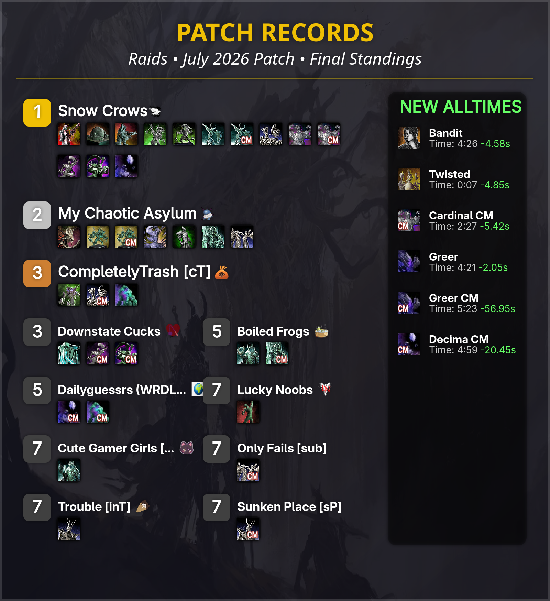

# patchy-post

Generates the **patch records** post image for Guild Wars 2 - the end-of-patch
standings graphic showing which team holds the fastest kill on each raid or
strike boss, plus the new all-time records set during the patch.



All data comes from the [gw2wingman](https://gw2wingman.nevermindcreations.de)
public API. Nothing is hardcoded per patch - the era defaults to the newest
patch wingman knows about.

## Usage

```bash
npm install
npm run raid      # -> raid_patch_records.png
npm run strike    # -> strike_patch_records.png
```

Or directly, for more control:

```bash
node index.js [raid|strike] [--era <patch-id>] [--out <file.png>]
```

| Flag | Default | Meaning |
| --- | --- | --- |
| `raid` / `strike` | `raid` | Which encounter type to chart |
| `--era` | newest patch | Wingman patch id, e.g. `26-07` - use this to rebuild an old post |
| `--out` | `<type>_patch_records.png` | Output path |
| `--refresh-icons` | off | Re-download team icons that are already cached |

Alongside the image the script prints a markdown table of every boss, the team
that holds it, the time, and a link to the log - handy for the forum/Discord
post body.

`canvas` is a native module, so `npm install` needs build tooling (Cairo,
Pango, libjpeg). On Arch: `pacman -S cairo pango libjpeg-turbo giflib`.

## How it works

1. `GET /api/bosses` - every encounter, filtered to the requested type and
   sorted by wingman's own display order. Bosses with `hasCM` are queried a
   second time under the negated boss id.
2. For each boss, `GET /api/boss?bossID=…&era=<era>` gives the patch's fastest
   kill (`duration_top`, `group_top`, `link_top`). The same call with
   `era=all` gives the all-time fastest; if the two point at the same log, the
   patch record *is* a new all-time.
3. For a new all-time, every earlier patch is queried to find the previous best
   time, and the delta is what shows as `-1.23s` in the right-hand column. No
   earlier kill at all means a brand-new encounter, rendered as `(new)`.
4. Teams are ranked by how many bosses they hold, using standard competition
   ranking (1, 2, 2, 4). The top 3 get a full-width row with a medal colour;
   everyone else is laid out in two columns.
5. Boss icons are downloaded from wingman on first use and cached in
   `boss_icons/`. Team icons are fetched the same way into `group_icons/` -
   see below.

## Team icons

Wingman hosts the team logos, but there is no API for them and the filenames
are arbitrary: "Snow Crows" is served as `SC.png`, "My Chaotic Asylum" as
`MCA_LOGO_2.png`. The group name only appears in the `title` attribute of the
`` on a log page.

So for each team in the standings the script opens one of that team's own
record logs, finds the `groupIcons/…` image whose title matches the team name,
and caches it as `group_icons/<slug>_icon.png` - the lowercased team name with
spaces as underscores, all other punctuation stripped. Cached icons are reused
on later runs; `--refresh-icons` re-downloads them.

Two consequences worth knowing:

- Wingman keeps the old filename when a team renames, so "Trouble [inT]"
  correctly resolves to `Skein Gang Trouble [SG].png`. The old slug is kept in
  the repo too, since rebuilding an older `--era` will ask for it by its
  then-current name.
- Not every team has uploaded a logo. Those log `No wingman icon for "…"` and
  render without one. To override any of it - a team with no wingman logo, or
  one whose logo you don't want - just drop your own PNG at the slug path and
  the script will leave it alone.

## Notes

- Layout is measured in a `scaleFactor`-multiplied coordinate space; bumping
  `scaleFactor` at the top of `index.js` re-renders the whole thing at a higher
  resolution.
- The `'Segoe UI'` font stack falls back to whatever sans-serif is installed,
  so output on Linux will not be pixel-identical to output on Windows.
